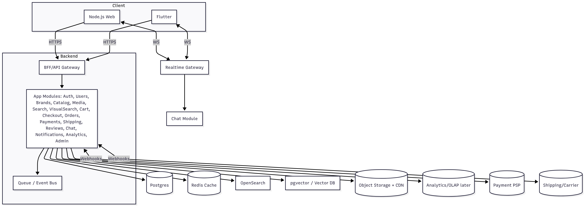

# 🏢 Corporate Training & Skill Management System

A Back-end system for companies to manage employee and intern training, skills, courses, assessments, enrollments, and achievements.
This project provides a scalable foundation for corporate learning platforms with robust authentication, validation, reporting, and integrations.

## Features

- ### User Management

  - Signup, login, profile update, self-deletion

  - Role-based access (Admin, Manager, Trainer, Employee, Mentor)

  - Departments with enum validation

  - Photo & resume uploads (Multer + Cloudinary integration)

- ### Authentication & Security

  - JWT with secure refresh token flow (HttpOnly cookies, rotation, logout)

  - Header-only access tokens

  - Password hashing with bcrypt

  - Global error handling with custom AppError

- ### Skills & Endorsements

  - CRUD operations with Zod validation

  - Nested skill endorsements

  - Skill history with transactional guarantees

  - Skills gained automatically through completed courses

- ### Courses & Learning Paths

  - CRUD with validation and query features (filter, paginate, sort)

  - Categories and prerequisites

  - Auto-enroll flow in learning paths with duplicate-enrollment protection

  - Review & rating system with sentiment analysis

  - Redis caching for optimized course queries

- ### Assessments & Quizzes

  - Assessment model with validation (questions, options, passing score, time limits)

  - CRUD endpoints for assessments and questions

  - Weighted question support

  - Quiz results with dynamic pass/fail evaluation

  - Enrollment auto-completion upon passing assessment

- ### Enrollments

  - Track employee course progress (ENROLLED → IN_PROGRESS → COMPLETED)

  - Course assessment submission flow

- ### Badges & Achievements

  - Badge & UserBadge models

  - Event-driven system (course completion, skill endorsement)

  - In-memory badge engine with cached badge criteria

- ### Notifications & Webhooks

  - Notification model & inbox

  - Automatic notifications (assessment deadlines, enrollment confirmation, assessment results)

  - User-specific webhook support

- ### Reports & Analytics

  - Average course completion time

  - Skill popularity aggregation

  - Monthly notification volume

  - Course funnel analytics

  - Course ratings summary with sentiment analysis

## 🛠️ Tech Stack

- **Runtime**: Node.js (Express)

- **Database**: MongoDB + Mongoose (with Redis caching)

- **Validation**: Zod (strict mode with async safeParse)

- **Auth**: JWT (access/refresh), bcrypt

- **File Handling**: Multer, Sharp, Streamifier, Cloudinary

- **Utilities**: APIFeatures, express-async-errors, Sentiment

- **Containerization**: Docker (multi-stage builds, dev & prod compose files)

## Project Structure

```bash
.
├── models/          # Mongoose models (User, Skill, Course, Assessment, etc.)
├── controllers/     # Express controllers
├── services/        # Business logic layer
├── routes/          # API route definitions
├── utils/           # Helpers (AppError, APIFeatures, uploader, eventBus)
├── dev-data/        # Seed JSON files + import/delete script
├── config/          # Config files (enums, constants, etc.)
├── middlewares/     # middlewares files (validate, enrolled, etc.)
└── README.md

```

## 🏗️ System Architecture



## Getting Started

### Prerequisites

- Node.js v18+

- MongoDB

- Redis

- Docker (optional, for containerized setup)

## Installation

```
git clone https://github.com/your-org/training-system.git
cd training-system
npm install
```

## Environment Variables

```
// Server Configuration
NODE_ENV=development
PORT=3000

// Database Configuration
DATABASE=<yours>
DATABASE_PASSWORD=<yours>

// JWT
ACCESS_TOKEN_SECRET=<yours>
ACCESS_TOKEN_EXPIRES_IN=<yours>
REFRESH_TOKEN_SECRET=<yours>
REFRESH_TOKEN_EXPIRES_IN=<yours>
JWT_COOKIE_EXPIRES_IN=<yours>

// CLOUDINARY
CLOUDINARY_CLOUD_NAME=<yours>
CLOUDINARY_API_SECRET=<yours>
CLOUDINARY_API_KEY=<yours>

// REDIS
REDIS_USERNAME=<yours>
REDIS_PASSWORD=<yours>
REDIS_URL=<yours>
REDIS_PORT=<yours>
```

## Seed Data

```
node dev-data/data/dev-data.js --import   # Import users, skills, courses, assessments, etc.
node dev-data/data/dev-data.js --delete   # Delete all seeded data
```

## Run

```
npm run dev   # Development with hot reload
npm start     # Production
```

## API Highlights

- **Auth**: `POST /signup`, `POST /login`, `POST /refresh`, `POST /logout`

- **Users**: `GET /users`, `POST /users`, `PATCH /users/:id`, `DELETE /users/:id`, `PATCH /users/updateMe`

- **Skills**: `GET /skills`, `POST /skills`, `PATCH /skills/:id`, `POST /skills/:skillId/endorse`

- **Courses**: `GET /courses`, `POST /courses`, `PATCH /courses/:id`, `GET /courses/:courseId/reviews`

- **Learning Paths**: `POST /:pathId/auto-enroll`

- **Assessments**: `GET /assessments`, `POST /assessments`, `PATCH /assessments/:id`, `POST /courses/:courseId/submit`

- **Notifications**: `GET /notifications/inbox`, `POST /notifications`

- **Reports**: `/avg-completion-time`, `/skill-popularity`, `/monthly-notification-volume`, `/course-funnel/:courseId`, `/course-ratings-summary`

## Future Enhancements

- Mentorship programs & mentorship badges

- Gamification dashboards

- Multi-language support (Arabic/English)

- Frontend integration (Angular/React)

---
